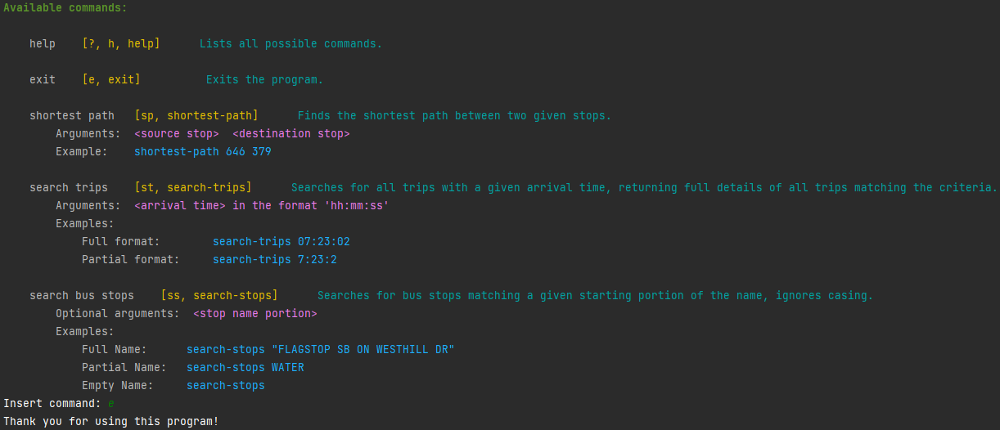

# Bus Management System

A bus management system for Vancouver built for a college assignment.  

Link to repository: https://github.com/Chuset21/bus-management-system  
The `stops.txt`, `stop_times.txt` and `transfers.txt` files must be placed inside the [src/main/resources](src/main/resources) folder.

## Requirements

- Java 17

## Running

Make sure to download the [jar file](jar/bus-management-system-1.0-SNAPSHOT.jar) in the jar directory or from [releases](https://github.com/Chuset21/bus-management-system/releases).  
Open your preferred terminal.
cd into the directory where this jar is stored (it doesn't have to be stored anywhere specific) `cd some-directory`  
In the command line run: `java -jar bus-management-system-1.0-SNAPSHOT.jar`  
If you would like to force an ansi setting there are these options for the optional argument `enable-ansi`:
- `auto` (this is the default)
- `true/on`
- `false/off`  

For example if you wanted no ANSI colors you would run it like so:  
`java -jar bus-management-system-1.0-SNAPSHOT.jar enable-ansi=off`  
If you wanted to force ANSI colors you would run it like so:  
`java -jar bus-management-system-1.0-SNAPSHOT.jar enable-ansi=on`

## Using

Pass arguments separated by spaces/tabs.  
If you would like to pass an argument containing white space please make sure to surround the argument with quotation marks, like so __"argument with spaces"__.

## Colors

I suggest using a console with a black background (since the colors are bright) that supports __ANSI__ coloring, if you don't know if your console supports it, don't worry, the program should take care of that.  
If the program doesn't automatically detect ANSI support, or you want to turn ANSI coloring off try seeing the [Running section](#running) for options.

Known consoles to not support ANSI:
 - Command prompt  
 - Windows Powershell  

Known consoles to support ANSI:
- Most Unix consoles  
- IntelliJ console  
- [Windows Terminal](https://aka.ms/terminal)  

This is what it looks like on my IntelliJ console which supports ANSI coloring, the best coloring I've seen on Windows.  

